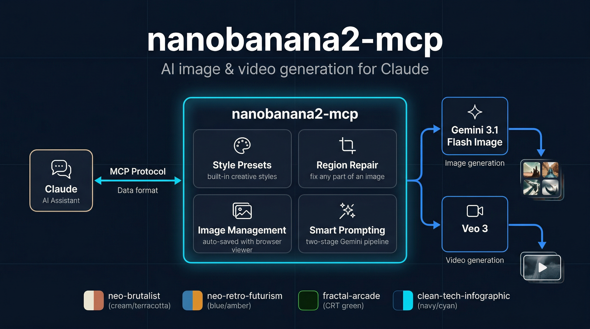
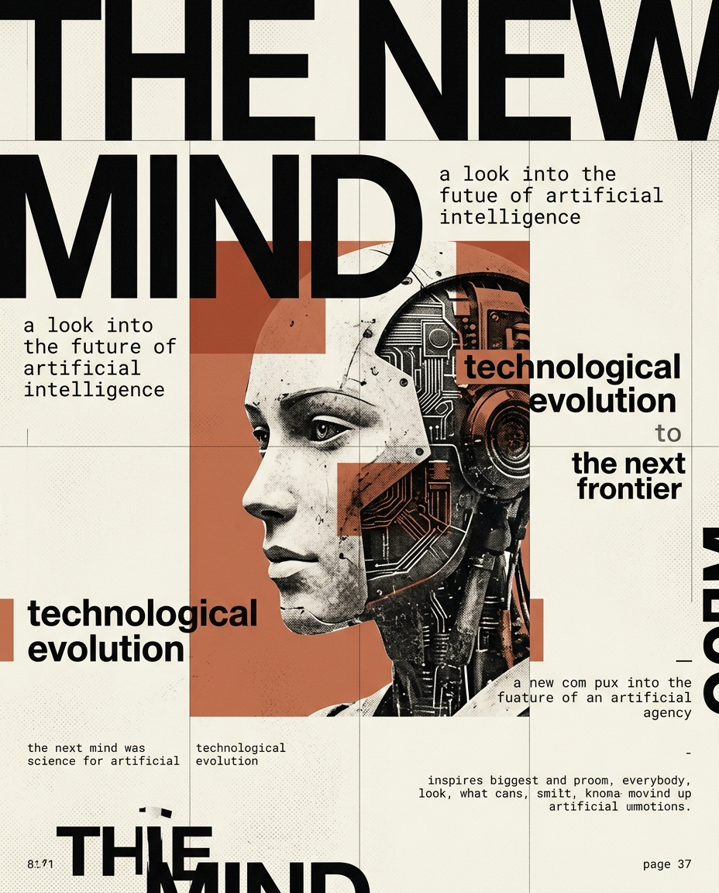
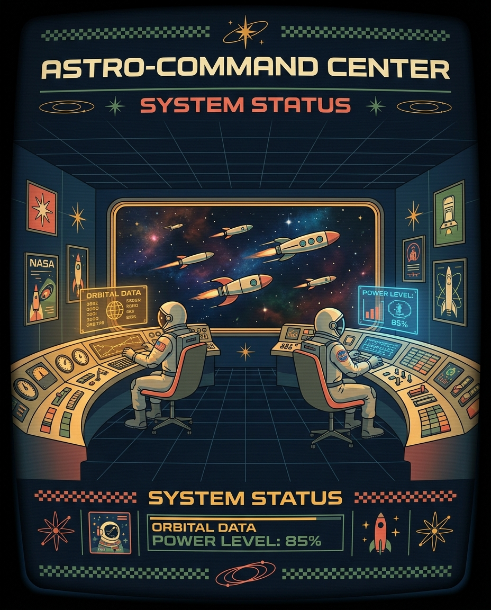
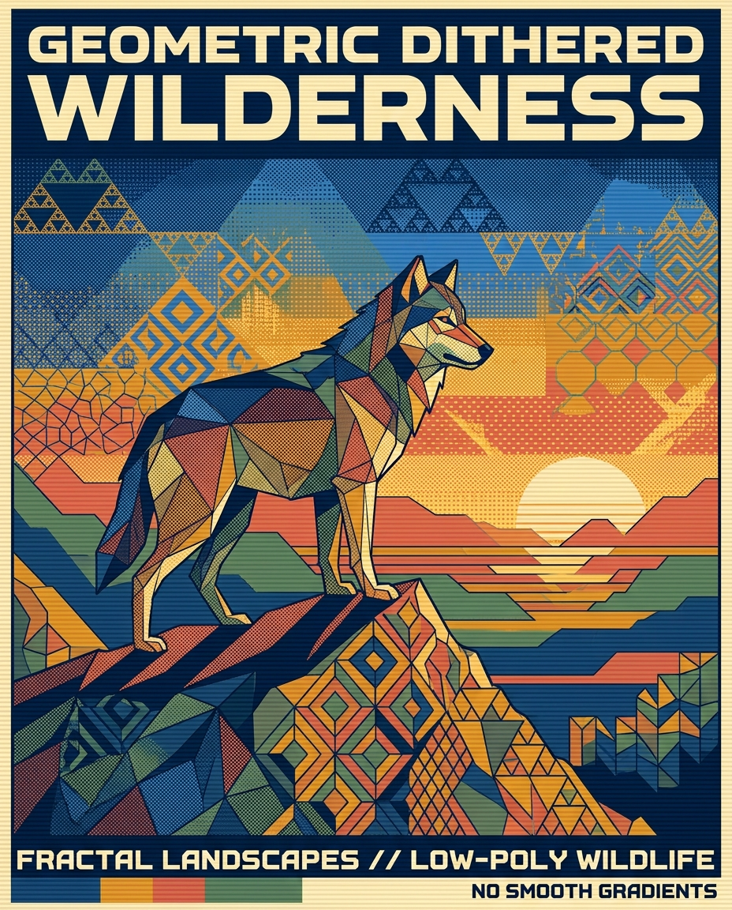
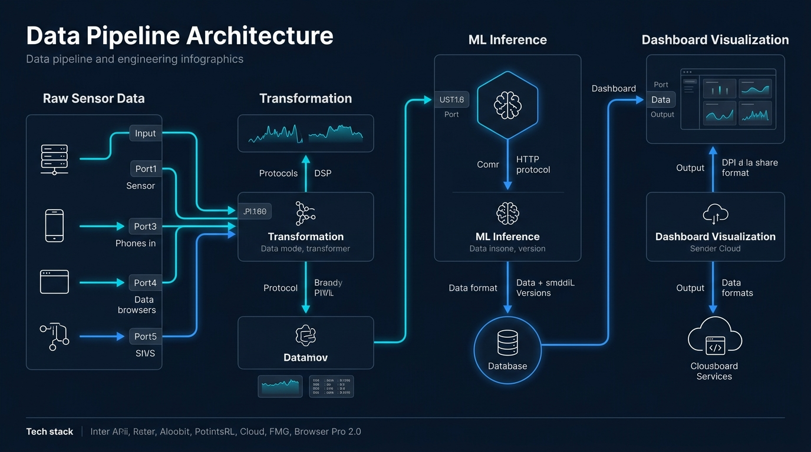

<p align="center">
  
</p>

<h1 align="center">nanobanana2-mcp</h1>

<p align="center">
  <strong>MCP server for AI image &amp; video generation</strong><br/>
  Powered by Gemini 3.1 Flash Image and Veo 3
</p>

<p align="center">
  
  
  
  
</p>

---

An [MCP](https://modelcontextprotocol.io) server that gives Claude (or any MCP client) the ability to generate images, edit them, fix garbled text, and create videos — all through natural language.

## How it works

Google's image generation pipeline (internally called "nanobanana2") uses a two-stage approach:

1. **Gemini 3.1 Pro** reasons about your prompt (text)
2. **Gemini 3.1 Flash Image** renders the pixels

For video, the server calls **Veo 3** with async polling — generating both video and ambient audio.

Flash struggles with text-heavy images. The fix tools solve this by sending smaller regions to Gemini, then stitching the results back with histogram-matched compositing for seamless blending.

## Tools

| Tool | Description |
|------|-------------|
| `generate_image` | Text-to-image generation (single image) |
| `generate_images` | Parallel batch generation (1-8 images) |
| `generate_video` | Text-to-video via Veo 3 with audio (5s or 8s) |
| `edit_image` | Edit an existing image with natural language instructions |
| `fix_image` | Grid-based tile repair for garbled text (2x2, 3x3, etc.) |
| `fix_region` | Targeted region repair with automatic aspect ratio snapping |
| `interactive_fix` | Browser-based crop UI with multi-shot selection |
| `list_images` | List generated images and videos |
| `save_image` | Import an external image into the workspace |

## Style presets

All generation and edit tools support an optional `style` parameter:

### `neo-brutalist`
Magazine editorial, bold typography, halftone textures. Cream, black, and terracotta palette.



### `neo-retro-futurism`
1960s Space Age meets 1980s arcade. Cathode blue, amber, and salmon palette.



### `fractal-arcade`
Dithered fractals, Sierpinski patterns, low-poly. CRT retro, Amiga/EGA palette.



### `clean-tech-infographic`
Technical diagrams, system flows, data pipelines. Dark navy, cyan, and electric blue.



## Setup

### Prerequisites

- Node.js 18+
- A [Google AI API key](https://aistudio.google.com/apikey) with access to Gemini and Veo models

### Install

```bash
git clone https://github.com/j-east/nanobanana2-mcp.git
cd nanobanana2-mcp
npm install
npm run build
```

### Configure your MCP client

Add to your Claude Code or Claude Desktop config:

```json
{
  "mcpServers": {
    "nanobanana2": {
      "command": "node",
      "args": ["/path/to/nanobanana2-mcp/dist/index.js"],
      "env": {
        "GOOGLE_API_KEY": "your-api-key-here"
      }
    }
  }
}
```

### Image output

Generated images are saved to `~/Pictures/nanobanana2/`. A local browser viewer auto-launches on first use for full-resolution previews.

## Development

```bash
npm run dev    # tsx watch mode
npm run build  # compile TypeScript
npm run start  # run compiled server
```

## Key implementation details

- **Aspect ratio snapping** — crops are adjusted to the nearest Gemini-supported ratio while preserving center point
- **Histogram matching** — per-channel RGB normalization ensures composited regions blend seamlessly
- **Human-in-the-loop** — `interactive_fix` opens a browser crop UI, blocks via Promise until the user submits, fires parallel Gemini calls, and lets the user pick the best result
- **MCP size limits** — full-resolution images are saved to disk; downsampled versions (< 950KB) are returned in MCP responses

## Contributing

PRs are welcome! We're especially looking for:

### New style presets

Add entries to the `STYLE_PRESETS` object in `src/index.ts`. Your PR should include:

- The preset definition (name, prompt prefix, default aspect ratio)
- 2-3 example images generated with the preset (drop them in your PR description)
- A short description of the visual style for the README table

### Model adapters

Currently nanobanana2 is wired to Gemini 3.1 Flash Image and Veo 3. We'd love adapters for other image/video generation APIs — Stable Diffusion, DALL-E, Flux, etc. If you're interested in adding one, open an issue first so we can align on the interface.

## License

MIT
